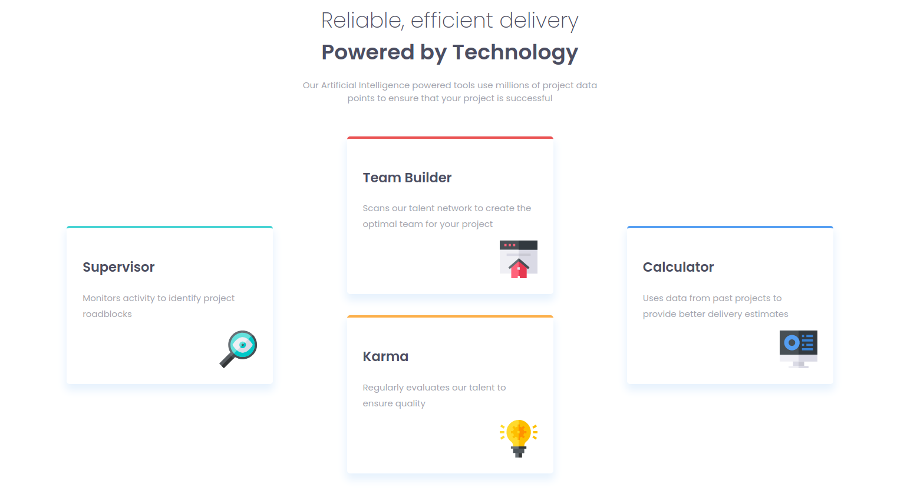

# Frontend Mentor - Four card feature section solution

This is a solution to the [Four card feature section challenge on Frontend Mentor](https://www.frontendmentor.io/challenges/four-card-feature-section-weK1eFYK). Frontend Mentor challenges help you improve your coding skills by building realistic projects. 

## Table of contents

- [Overview](#overview)
  - [The challenge](#the-challenge)
  - [Screenshot](#screenshot)
  - [Links](#links)
- [My process](#my-process)
  - [Built with](#built-with)
  - [What I learned](#what-i-learned)
  - [Continued development](#continued-development)
  - [Useful resources](#useful-resources)
- [Author](#author)
- [Acknowledgments](#acknowledgments)

## Overview

### The challenge

Users should be able to:

- View the optimal layout for the site depending on their device's screen size

### Screenshot




### Links

- Solution URL: https://github.com/SKLymer/Four-Card-Feature
- Live Site URL: https://four-card-feature-sklymer.netlify.app/
## My process

### Built with

- Semantic HTML5 markup
- CSS custom properties
- Flexbox
- CSS Grid
- Desktop first Workflow

### What I learned

I was reintroduced to grid-area property forund a practical application for it. The flex wrap broke my layout at 925px, and gave it a really weird shape, I had no idea if it could be realigned using flex,, but I had a good idea on how to fix it using grid. 

When I switched the container to a grid layout The column with the double element stretched one grid cell verically and misalign ed the layout so I used grid-area to place the two single element columns into one grid cell, to give it a 2 x 2 layout. 

I also tried to use the span value on grid-rows to try to fix the issue but the various margins I had applied to each individual element made it really hard to align. 


```css
***************** */
@media (max-width: 1350px) {
    
    .feature-section {
        display: grid;
        grid-template-columns: repeat(auto-fit, minmax(350px, 1fr));
        justify-items: center;
        flex-direction: column;
    }

    .col-1 {
        grid-area: 1/1/2/2;
        align-self: baseline;
        margin: 2rem 0;
    }
    .col-4 {
        grid-area: 1/1/2/2;
        margin: 2rem 0;
        align-self: flex-end;
    }
    .col-5 {
        grid-area: 1/2/2/3;
    }
}

```


### Continued development

Explore the more advanced functions and layouts using grid.


### Useful resources

https://developer.mozilla.org/en-US/docs/Web/CSS/CSS_Grid_Layout/Basic_Concepts_of_Grid_Layout

